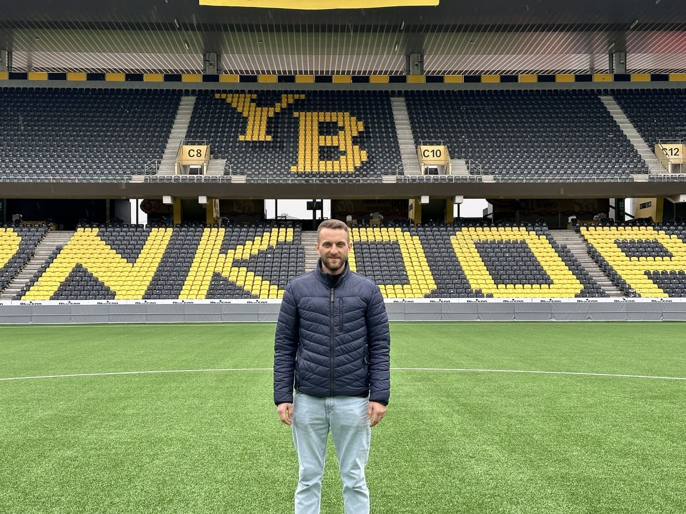

+++
title = "Das Leben nach den Spitzensport"
date = "2024-06-11"
draft = true
pinned = true
tags = ["Fussball"]
image = "football-pic.jpg"
description = "Die Welt des Spitzensports ist brutal. Fussball ist eines der besten Beispiele. Nur wenige schaffen es, bei den grossen Vereinen zu spielen, und das Zeitfenster ist klein. Mit etwa 35 Jahren gilt ein Spieler als alt oder nicht mehr so gut wie früher. Da so viele junge Menschen diesen Traum verfolgen, stellt sich die Frage: Was kommt nach dem Fußball?"
footnotes = "Stephen Keane ist ein 16-jähriger Schüler der Campus Muristalden AG in Bern und besucht das zweite Jahr Gymnasium und interessiert sich für jede Form von Sport."
+++


Das Leben nach dem Spitzensport ist schön, entspannend und bietet neue Möglichkeiten. Die Athleten haben Zeit für ihre Familien, für ihre psychische Gesundheit oder um Stress abzubauen. Es ist aber auch beängstigend und unsicher. Kann ich Arbeit finden? Was für eine Arbeit will ich machen? Solche Fragen waren für Christian Schneuwly nicht so beängstigend.





Christian Schneuwly hat im Jahr 2021 seine Karriere beendet. Er war insgesamt 6 Jahre bei YB, 3 Jahre bei Thun und Luzern, 2 Jahre bei Lausanne-Sport und Zürich und je 1 Jahr bei Biel und Lausanne-Ouchy. Als er zurücktrat spielte er beim FC Düdingen. Der 36-jährige ehemalige Mittelfeldspieler wurde 1988 in Wünnewil geboren, ist heute Assistenztrainer der YB U21-Mannschaft und ist verheiratet mit Kinder.



## Das Treffen

Am Freitagnachmittag ist im Wankdorf nicht viel los. Es ist ruhig, auf den langen Boulevards und in den Trams ist kaum jemand unterwegs. Das riesige Stadion nähert sich und die Nervosität beginnt. Die riesigen Garagentore, durch die die Spieler normalerweise einlaufen, wirken bedrohlich. Man spürt die Macht und den Einfluss des Vereins und kann fast den Jubel vergangener Siege durch das Stadion hallen hören. Aus einem Garagentor tritt Christian Schneuwly und begrüßt mich. Er führt mich durch die verschiedenen Mannschaftsbusse, die dort parkiert sind, und ich erhasche einen Blick auf das Spielfeld, der mich als YB-Fan begeistert. Ich war schon oft im Wankdorf Stadion aber nie woanders als auf meinen Plätzen für die ich Saisonkarten habe. Wir sind jetzt am Ende des Tunnels wo die Spieler aufs Feld laufen können. An einer Wand hängt ein Schild mit der Aufschrift Garderobe. Der ganze Raum wirkt wichtig. Hier haben schon die größten Vereine Europas gespielt. Christian schlägt vor, kurz durch den lichtdurchfluteten Tunnel auf das Spielfeld zu gehen. Der Nacken tut fast weh, so riesig sind die Tribünen.

