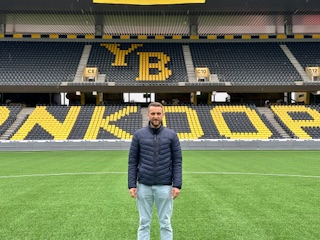

+++
title = "Was jetzt?"
date = "2024-03-22"
draft = false
pinned = true
image = "yb-stadium-pic2.jpg"
+++



Ein Blick in das Leben einer Profifussballer nach die Karriereende





Christian Schneuwly hat 2021 seine Karriere beendet. Er war insgesamt 6 Jahre bei YB, 3 Jahre bei Thun und Luzern, 2 bei Lausanne-Sport und Zürich und je 1 Jahr bei Biel und Lausanne-Ouchy. Als er zurücktritt spielte er bei FC Düdingen.



**Sie haben letztens euere Karriere beendet. Was hat dazu geführt, dass sie aufgehört haben? Was waren die Umstände?**

 Ich hätte sicher gerne noch weitergespielt. Das Problem war so, Ich war bei Lausanne-Sport und sie wollten mehr auf den jungen Spieler setzten. Ich wurde dann auch zu Lausanne Ouchy im Challenge League ausgelehnt und es war eigentlich gut gewesen aber es war dann auch das Thema, wo geht es jetzt hin, wo kann ich nochmal in einem Club spielen. Mein Sohn war dann etwa 4 Jahre alt und mit 5 fängt schon Kindergarten an. Dann war auch der Thema ziehen wir nochmal um, ziehen wir in ein anderes Land, Ja oder Nein, was sind überhaupt für Finanzielle möglichkeiten noch vorhanden, reicht es überhaupt, dass du deine Fixkosten leisten kannst. Das sind alle Überlegungen die mitgespielt haben und dann auch im Hinterkopf das die Karriere irgendwann mal zu Ende ist und ich habe gesagt, dass es die richtige Zeitpunkt ist aber das mein Sohn im Kindergarten anfängt war sicher der Hauptthema.

**Wie hat es euere Familie beeinflusst?**

Ich hatte so viel Zeit nach der Karriere wo ich nicht wusste was ich machen wollte. Ich war zuerst bei der Arbeitslosekasse gewesen. Nacher so ein Leerzeit und natürlich di Familie geniessen aber immer noch die Frage was will ich jetzt genau machen. Nacher habe ich immer noch gespielt in Düdingen in der zweite liga und natürlich regelmässig training und dann am Wochenende noch Match.

**Sie sind danach in einem ‘normalen’ Job eingestiegen. Was war das?**

Wo ich aufgehört habe, wollte ich immer zuerst vom Fussball weg. Ich hatte genug vom ganzen Business. Ich wollte zuerst mal etwas anderes ausprobieren nicht nur immer als Fussballer sondern mal schauen was gibt es überhaupt für möglichkeiten. Schlussendlich habe ich eine gute Lösung gefunden. Ich habe ein Coaching gemacht wo ich herausfinden könnte was meine Stärken überhaupt sind und Ich habe mich entschieden zu Migros im HR Bereich zu gehen.

**Haben sie sich diese Karriere gewünscht oder hätten sie sich eine andere gewünscht?**

Nein ich habe wirklich gar nicht gewusst welchen Weg ich gehen wollte. Für mich ist Fussball der Traumjob gewesen. Ich habe vor meine Karriere einen Lehr gemacht aber es waren halt so die Umstände entsprechend und du musst etwas machen damit du etwas hast und nicht irgenwie weil ich gerne im Büro schaffe. Es war einfach so und  es ist gut vereinbarigkeit im ganzen KV Bereich und von dem her musste ich zuerst schauen was ich wollte aber och habe mich relativ schnell daran gewöhnt.

 

**Hätten sie sich etwas anders gewünscht beim Wechsel?**

Nicht wirklich. Nicht wirklich. Ich habe mich bewusst Zeit genommen und bewusst Möglichkeiten offen gelassen, was möglich ist und was nicht. Ich hatte mit vielen Personen kontakt und ich habe mit ihnen angeschaut was mache ich gern was will ich gerne machen aber die Frage stellen was ich überhaupt nach der Fussball machen kann war schon die schwierigste Frage. Für mich war es tip top so wie es war und ich hätte jeztz nichts Grosses geändert.

 

**Sie sind dann auch wieder zum Fussball zurückgekehrt. Habt Ihr das wollen, oder wie ist es dazu gekommen?** 

Also ich habe bei der Migros eigentlich in so Richtung Berufsbildung gehen wollen. Das hätte mir sehr gepasst mit guten Leute schaffen aber war dann nicht möglich. Und es war ein bisschen ein Problem von mir, weil ich andere Tätigkeiten gemacht habe. Also ich hab dann ein Diplom angefangen und Trainer von meinem Sohn gemacht und hatte dann so eine Idee und dann hat es mich gepackt. Dann habe ich das Diplom gemacht und es gefällte mir gleich als Trainer

 

**Und jetzt passt so, und kommen Sie gut klar mit Trainer sein?** 

 Ja, mega, mega. Das ist wirklich, wo ich meine Fähigkeiten einbringen kann und was ich sonst so als Spieler und als Mensch erlebt habe. Und ich schaue, dass ich den Jungen auf ihren Weg viel mitgeben kann. Wenn du natürlich Karriere gemacht hast, ist es noch etwas glaubhafter, dann glaubt man auch mehr an dich und du kannst die Spieler verstehen. Es ist trotzdem noch etwas anderes Trainer zu sein als wen du ein Spieler bist. 

**Haben Sie vielleicht Tipps für Profispieler, die jetzt am Ende ihrer Karriere sind, oder in einer ähnliche Situation sind wie sie waren?** 

 Ich glaube es ist sehr individuell. Es ist, jeder hat ein bisschen sein eigener Weg. Ich glaube es gibt sicher ein paar, wo du sagst du musst so oder so Planen du musst einfach wissen, wann willst du aufhören. Vielleicht vorgängig planen, obwohl das auch nicht immer möglich ist, weil plötzlich hast  du eine Verletzung oder hast keinen Vertrag mehr und kannst nicht mehr weiterspielen. Also zurück kannst du nicht mehr, wenn es einmal vorbei ist, ist vorbei. Ich glaube das muss dir klar sein, dass es endgültig vorbei ist. Und vollzeitig planen

