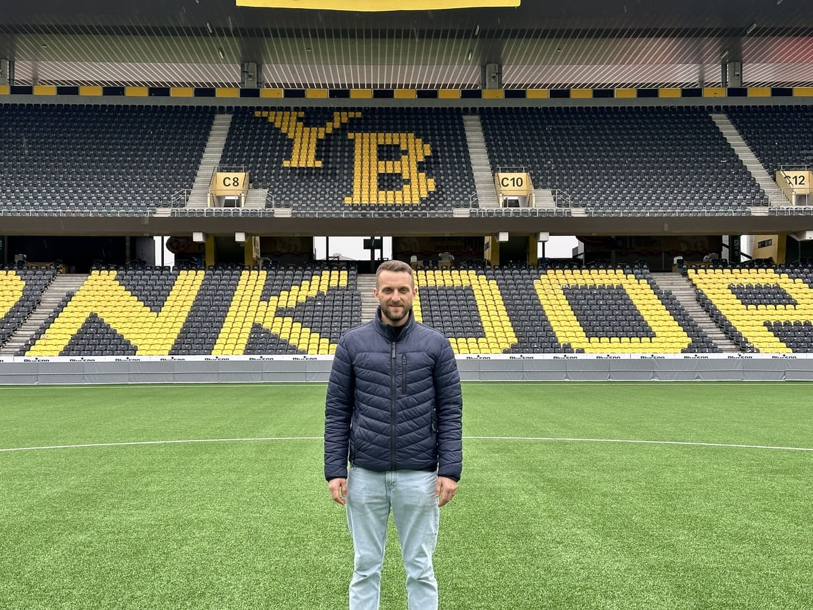

+++
title = "Was jetzt?"
date = "2024-03-22"
draft = false
pinned = true
image = "yb-stadion-pic1-2-.jpg"
footnotes = "Stephen Keane ist ein 16-jähriger Schüler der Campus Muristalden AG in Bern und besucht das zweite Jahr Gymnasium und interessiert sich für jede Form von Sport."
+++


**Ein Blick in das Leben eines Profifussballes nach der Karriereende.**





Christian Schneuwly hat im Jahr 2021 seine Karriere beendet. Er war insgesamt 6 Jahre bei YB, 3 Jahre bei Thun und Luzern, 2 Jahre bei Lausanne-Sport und Zürich und je 1 Jahr bei Biel und Lausanne-Ouchy. Als er zurücktrat spielte er beim FC Düdingen. Der 36-jährige ehemalige Mittelfeldspieler wurde 1988 in Wünnewil geboren, ist heute Assistenztrainer der YB U21-Mannschaft und ist verheiratet mit Kinder.



**Sie hatten eine erfolgreiche Karriere als Profi-Fußballer. Was waren die Höhepunkte Ihrer Karriere?**

Der erste Vertrag, den ich bei YB unterschreiben durfte. Das erste Spiel für YB. Das erste Goal bei YB. Sicher auch der Super League Titel bei Lausanne-Sport, aber auch das Europa League Spiel gegen Liverpool in Anfield, das ich spielen durfte. Das ist sicher eines der grössten Highlights gewesen.

> *Das Adrenalin bei einem Goal oder einen Sieg ist natürlich schon genial.*

**Sie haben letztens Ihre Karriere beendet. Was hat dazu geführt, dass sie aufgehört haben? Was waren die Umstände?**

Ich hätte sicher gerne noch weitergespielt. Das Problem war so, Ich war bei Lausanne-Sport und sie wollten mehr auf die jungen Spieler setzen. Ich wurde dann auch zu Lausanne Ouchy in der Challenge League ausgeliehen. Es war eigentlich gut gewesen, aber es war dann auch das Thema, wo geht es jetzt hin, wo kann ich nochmal in einem Club spielen. Mein Sohn war etwa 4 Jahre alt und mit 5 fängt schon der Kindergarten an. Dann war auch das Thema ob wir nochmal umziehen, ziehen wir in ein anderes Land. Was sind überhaupt noch für finanzielle Möglichkeiten vorhanden, reicht es überhaupt, dass du deine Fixkosten leisten kannst. Das sind alle Überlegungen, die mitgespielt haben, und dann auch im Hinterkopf, dass die Karriere irgendwann mal zu Ende ist. Ich habe gesagt, dass es der richtige Zeitpunkt ist, aber dass mein Sohn im Kindergarten anfängt, war sicher das Hauptthema.

**Wie hat es Ihre Familie beeinflusst?**

Ich hatte so viel Zeit nach der Karriere, sodass ich nicht wusste, was ich machen wollte. Ich war zuerst bei der Arbeitslosenkasse gewesen. Nachher ein Leerzeit und natürlich die Familie geniessen, aber immer noch die Frage, was will ich jetzt genau machen. Nachher habe ich immer noch in Düdingen in der zweite Liga gespielt. Natürlich hatte ich auch regelmässig training und dann am Wochenende noch Match.

**Sie sind danach in einen "normalen" Job eingestiegen. Was war das?**

Als ich aufgehört habe, wollte ich immer zuerst vom Fussball weg. Ich hatte genug vom ganzen Business. Ich wollte zuerst mal etwas anderes ausprobieren, nicht nur immer als Fussballer, sondern mal schauen, was es überhaupt für Möglichkeiten gibt. Schlussendlich habe ich eine gute Lösung gefunden. Ich habe ein Coaching gemacht, wo ich herausfinden konnte, was meine Stärken überhaupt sind. Ich habe mich entschieden zu Migros in den HR-Bereich zu gehen.

> *Ich wusste, ich wollte vom Fussball weg*
>
> *Es war schwierig für mich zu suchen oder auch das zu finden, was ich eigentlich schlussendlich wollte.*

**Haben Sie sich diese Karriere gewünscht oder hätten Sie sich eine andere gewünscht?**

Nein, ich habe wirklich gar nicht gewusst, welchen Weg ich gehen wollte. Für mich ist Fussball der Traumjob gewesen. Ich habe vor meiner Karriere eine Lehre gemacht, aber es waren so die Umstände entsprechend und ich muss etwas machen, damit ich etwas habe und nicht irgendwie weil ich gerne im Büro arbeite. Es war einfach so und  es ist gut vereinbar im ganzen KV Bereich. Und von dem her musste ich zuerst schauen, was ich wollte, aber ich habe mich relativ schnell daran gewöhnt.

**Hätten sie sich etwas anders gewünscht beim Wechsel?**

Nicht wirklich. Ich habe mich bewusst Zeit genommen und bewusst Möglichkeiten offen gelassen, was möglich ist und was nicht. Ich hatte mit vielen Personen Kontakt und ich habe mit ihnen angeschaut, was mache ich gern, was will ich gerne machen. Aber die Frage stellen, was ich überhaupt nach dem Fussball machen kann, war schon die schwierigste Frage. Für mich war es tip top so, wie es war, und ich hätte jetzt nichts Grosses geändert.

**Sie sind dann auch wieder zum Fussball zurückgekehrt. Haben Sie das gewollt, oder wie ist es dazu gekommen?** 

Also, ich habe bei der Migros eigentlich in so Richtung Berufsbildung gehen wollen. Das hätte mir sehr gepasst, mit guten Leute zu arbeiten, aber es war dann nicht möglich. Und es war ein bisschen ein Problem von mir, weil ich andere Tätigkeiten gemacht habe. Also ich habe dann ein Diplom angefangen, Trainer von meinem Sohn gemacht. Ich hatte dann so eine Idee und dann hat es mich gepackt. Danach habe ich das Diplom gemacht und es gefiel mir gleich als Trainer.

**Haben Sie vielleicht Tipps für Profispieler, die jetzt das Ende ihrer Karriere erreichen, oder in einer ähnlichen Situation sind, wie Sie waren?** 

 Ich glaube, es ist sehr individuell. Es ist so, jeder hat ein bisschen seinen eigenen Weg. Ich glaube es gibt sicher ein paar, wo man sagt, du musst so oder so Planen. Du musst es einfach selber wissen, wann du aufhören willst. Vielleicht vorgängig planen, obwohl das auch nicht immer möglich ist, weil plötzlich hast  du eine Verletzung oder hast keinen Vertrag mehr und kannst nicht mehr weiterspielen. Also zurück kannst du nicht mehr. Wenn es einmal vorbei ist, ist es vorbei. Ich glaube, das muss einem klar sein, dass es endgültig vorbei ist.